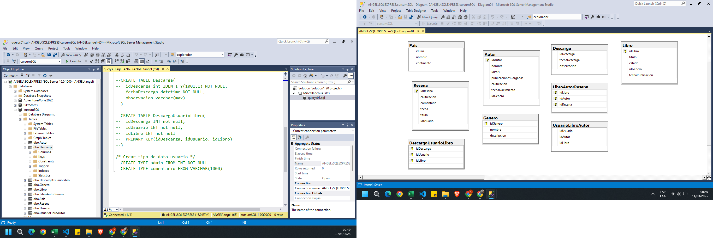
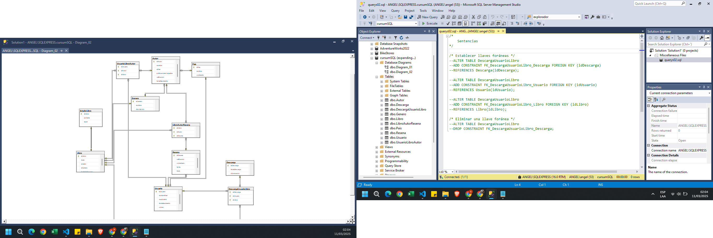

### Diseñando Nuestra Primer Base de Datos
    ✅ Crear Base de Datos y Tablas
    ✅ Propiedad IDENTITY
    ✅ Tipos de Datos de Usuario

### Relaciones y Restricciones entre Tablas
    ✅ Agregar y Eliminar Llaves Foráneas
    ✅ Relación de Uno a muchos, Muchos a muchos y Uno a uno

