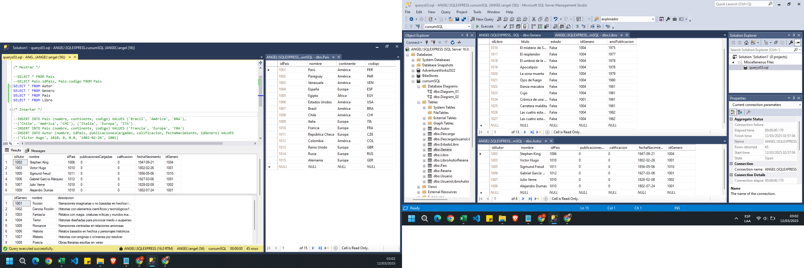
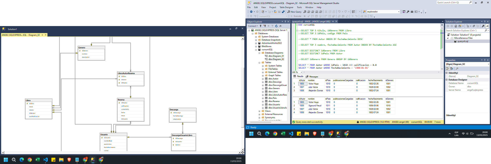
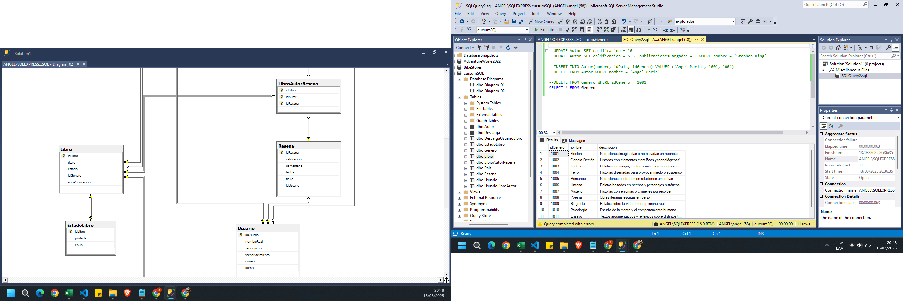
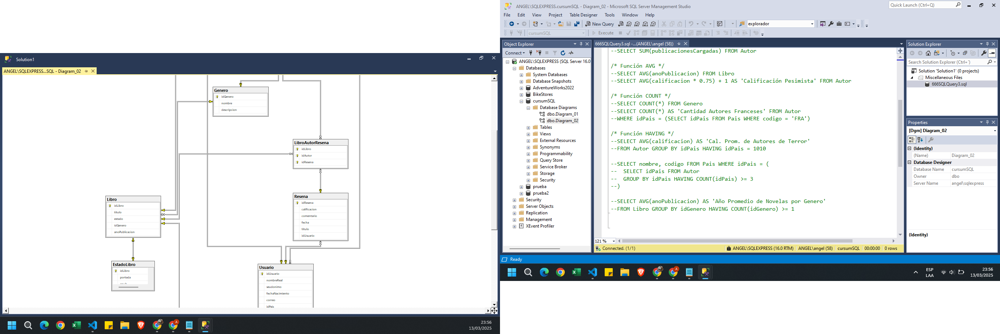

### Diseñando Nuestra Primer Base de Datos
    ✅ Crear Base de Datos y Tablas
    ✅ Propiedad IDENTITY
    ✅ Tipos de Datos de Usuario

### Relaciones y Restricciones entre Tablas
    ✅ Agregar y Eliminar Llaves Foráneas
    ✅ Relación de Uno a muchos, Muchos a muchos y Uno a uno

### Manipulación de registros DML con INSERT y SELECT
    ✅ Comando SELECT e INSERT
    ✅ Verificar restricciones de PK y FK

### Cláusulas SQL
    ✅ Cláusulas TOP, ORDER BY, DISTINCT, GROUP BY y WHERE
    ✅ Uso Combinado de estas Cláusulas

### Manipulación de registros DML con UPDATE y DELETE
    ✅ Comando UPDATE y DELETE
    ✅ Verificar restricciones de FK con DELETE

### Funciones de Agregado
    ✅ Función MAX y MIN
    ✅ Función SUM, AVG y COUNT
    ✅ Función HAVING

### Operadores Lógicos
    ✅ Operadores AND, OR y NOT
    ✅ Operadores IN, LIKE y BETWEEN
    ✅ Uso Combinado de Operadores

