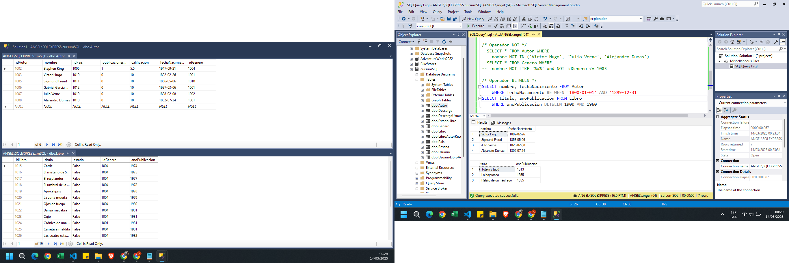

### Diseñando Nuestra Primer Base de Datos
    ✅ Crear Base de Datos y Tablas
    ✅ Propiedad IDENTITY
    ✅ Tipos de Datos de Usuario

### Relaciones y Restricciones entre Tablas
    ✅ Agregar y Eliminar Llaves Foráneas
    ✅ Relación de Uno a muchos, Muchos a muchos y Uno a uno

### Manipulación de registros DML con INSERT y SELECT
    ✅ Comando SELECT e INSERT
    ✅ Verificar restricciones de PK y FK

### Cláusulas SQL
    ✅ Cláusulas TOP, ORDER BY, DISTINCT, GROUP BY y WHERE
    ✅ Uso Combinado de estas Cláusulas

### Manipulación de registros DML con UPDATE y DELETE
    ✅ Comando UPDATE y DELETE
    ✅ Verificar restricciones de FK con DELETE

### Funciones de Agregado
    ✅ Función MAX y MIN
    ✅ Función SUM, AVG y COUNT
    ✅ Función HAVING

### Operadores Lógicos
    ✅ Operadores AND, OR y NOT
    ✅ Operadores IN, LIKE y BETWEEN
    ✅ Uso Combinado de Operadores

### Stored Procedures, Variables y Subconsultas
    ✅ Definición de Stored Procedures (ANSI_NULLS y QUOTED_IDENTIFIER)
    ✅ Manejo de Variables (DECLARE, SET y ISNULL)
    ✅ Programando Subconsultas

### Estructuras de Control
    ✅ Condicionales IF, ELSE, CASE
    ✅ Bucle WHILE y Estructura TRY CATCH
    ✅ Función EXISTS e Instrucciones RETURN y BREAK

### Operadores Aritméticos y de Comparación
    ✅ Operadores "+, -, *, /, %" para Números y Cadenas
    ✅ Operadores ">, <, <>, =" para Números y Cadenas

### Programando Stored Procedures de INSERT
    ✅ Programación de Inserciones Complejas
    ✅ Manejo de Errores y Duplicados

### Herramientas Adicionales
    ✅ Procesos SP_HELP y SP_HELPTEXT
    ✅ Establecer Atajos de Teclado

### Sentencias DDL
    ✅ Sentencias ALTER TABLE, ALTER COLUMN y DROP COLUMN
    ✅ Sentencias CREATE y ALTER para Funciones
    ✅ Sentencias CREATE, DROP y TRUNCATE para Tablas

### Funciones de Conversión y Texto
    ✅ Funciones para Cadenas: LEFT, RIGHT, LEN, LOWER y UPPER
    ✅ Funciones para Cadenas: REPLACE, REPLICATE, LTRIM, RTRIM, CONCAT
    ✅ Funciones para Fechas: GETDATE, DATEADD, DATEDIFF, DATEPART, ISDATE 
    ✅ Funciones de Conversión: CAST y CONVERT

### Transacciones
    ✅ Instrucción BEGIN TRANSACTION
    ✅ Instrucciones COMMIT TRAN y ROLLBACK TRAN

### JOINS y UNIONS entre Tablas
    ✅ Cláusulas INNER, LEFT y RIGHT JOIN
    ✅ Cláusulas UNION y UNION ALL

